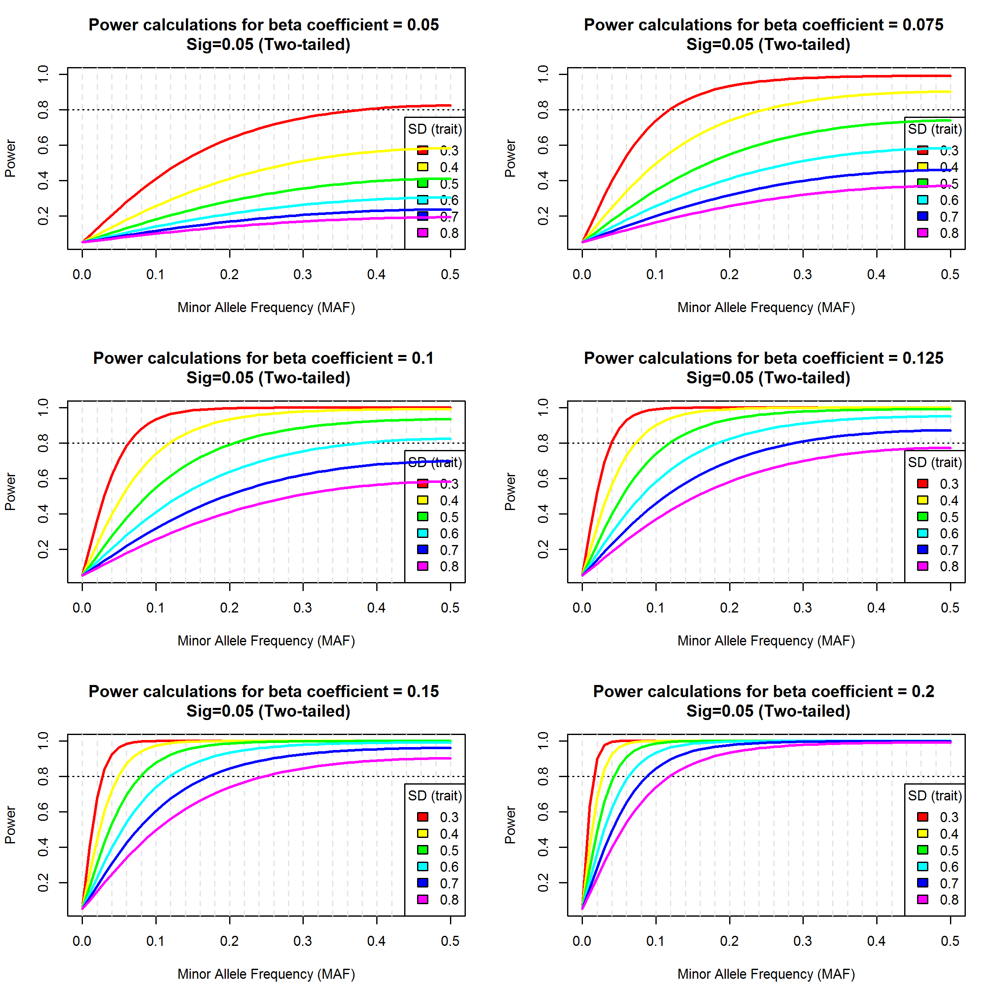

<!-- NOTES:
1. This is the source document for this project. I will treat this document as a plain text Markdown file to create Word docs, pdfs and html files. This document will be downloaded in plain text format so any formatting such as bullet points, font changes, bolding, header choices will not be saved. However, please add comments or edits as you see fit. I can clean up later.

2. Any text below preceded by an @ symbol is a placeholder for a citation.

3. To indicate formatting in plain text use the following notation.
Sections in this document start with a # symbol. Section 1 headings start with #, section 2 headings start with ##, etc..
**bold**
*italic*
$latex formula$

4. If you want to see what the text below looks like after formatting, you can cut and paste in https://stackedit.io/editor OR you can go to the web page with a recent version of updates in html format: html format or Word .docx format.

5. Used google code at following link to create heading numbering: http://stackoverflow.com/questions/12389088/google-docs-drive-number-the-headings

END OF NOTES
-->

**Version: 1**

[Please click here for location of working draft in google docs](https://docs.google.com/document/d/1_xVtfdZlZrNEcQyumGwLEdoAiZcuu-CqPqQrHQNSfg4/edit?usp=sharing)

Note: Borrowed format of SAP from [Pfizer](https://www.pfizer.com/files/research/research_clinical_trials/Clinical_Data_Access_Request_Sample_SAP.pdf)

<!-- Statistical Analysis Plan

SAP should delineate populations (exclusion criteria); end points; descriptive objectives; testable hypotheses; modifications or derivations of standard variables; statistical methods, including handling of missing data, correlated data, bias, and confounding; subgroups; interactions; and sensitivity analysis.
-->


# Abstract

Dyslipidemia is an important risk factor for chronic cardiometabolic diseases. Lipid traits are highly heritable and there are currently >185 established loci influencing lipid levels in adults. Recent studies have confirmed that variants associated with lipids identified in primarily European-descent adults influence lipid levels across the lifecourse, and across non-European adults. Given that Hispanic/Latinos (HL) shoulder much of the cardiometabolic burden in the U.S., it is important to identify those genetic variants that contribute the greatest risk for elevated lipid levels across life stages. Thus, our primary aim is to examine the association of known lipid variants identified in large, primarily European-descent, consortia studies of adult participants with lipid traits in a Chilean birth cohort sample (n=546) at a mean age of 16.8 years (sd=0.3) from 2008 to 2013 with genotyping and well-measured lipid phenotypes. We assessed single variant associations using linear regression for high density lipoprotein cholesterol (HDL-C), low density lipoprotein cholesterol (LDL-C) and triglycerides (TG), assuming an additive genetic model, adjusted for sex of child. Additionally, we regressed phenotypes onto weighted trait-specific polygenic risk scores (PRS). Only six variants from the Chilean sample met the a priori threshold of power > 0.8. We found statistically significant effect sizes (mmol/l (se)) for four of the six variants: rs3764261 (0.16 (0.04)) and rs1532085 (0.05 (0.04)) for HDL and rs1260326 (0.34 (0.15)) and rs964184 (0.33 (0.15)) for TG. For each significant variant, direction of effect matched the multiethnic adult GWAS from which SNPs were selected. We also compared our findings to a previous study in Finnish children and found an opposite direction of effect for our significance HDL variants. Likewise, when comparing coefficients for the PRS between the Chilean and Finnish youth sample we found the association to be stronger in the Chilean sample for every trait and gender group with the exception of LDL for males. The lipid loci explained the least amount of total variance for LDL (males=4% and females=5%) and the most amount of variance for HDL (males=20% and females=14%). In conclusion, there is evidence that lipid loci from a HL sample of children contain similar associations as those from European adults and children. Despite the small sample size and possibility for bias with different ancestral groups we found meaningful and statistically significant associations relating lipid loci in a HL cohort of children with those found in European ancestral groups. These associations emphasize the importance of childhood as a time for disease prevention given both the persistence of associations between PRS and CVD risk over the life course and the increasing role PRS plays in predicting disease.

Characters (w/o spaces): 2436 of max 2500


# Data Source

**Note: I copied this description of SLCS from my 2016 AHA application.**

The Santiago Longitudinal Cohort Study (SLCS) is an ongoing cohort starting with 1,657 infant participants from Santiago, Chile who completed the study at 12 months of age  from 1991 to  1996 [@lozoff_behavioral_2003] (see Figure 1). Participants were recruited during infancy and have been followed through childhood and adolescence into early adulthood (Lozoff and Gahagan, Multiple PI, R01 HD033487; Gahagan, PI, R01 HL088530). Originally established as part of a randomized clinical trial to investigate the effects of iron supplementation in formula-fed infants [@lozoff_behavioral_2003], SLCS is still active. Full-term infants with no iron-deficiency anemia or other major health problems were eligible to participate. Following the infant study, 679 children (Figure 1) from this cohort are participating in additional extensive cardiovascular testing at 17 and 21 years of age.


<!-- Note that the fig1.png file is located in ~\Dropbox\unc.grad.school\my-papers\ms-201608-1\programs --> 


# Analysis Objectives

The primary objective will be to examine the association between previously established lipid loci in adults and lipid traits in a cohort of children 16-18 years of age with Hispanic/Latino (HL) ancestry. We will compare the results with findings from a Finnish sample of children [@tikkanen_association_2011]. Similarities in findings across the two different groups could provide evidence towards the generalizability of lipid-related genetic variants and phenotypes. <!--This study would not be a replication study as the two populations are of different ethnic groups [@zondervan_designing_2007]. Differences in associations between the two groups could provide evidence of potential differences in lipid variant function in a HL sample compared to one of European descent.-->

In the Finnish study of 2,443 children [@tikkanen_association_2011] with lipid measures from ages 3 to 45 years, they examined the association between a genetic risk score (GRS) at each age, adjusting for gender. For all ages the GRS was strongly associated with the lipid outcomes: HDL-C, LDL-C, TC and TG. The 95 variants included in the study accounted for as much as 26.7% of the total variance in lipids for children ages 3-6 years with this number dropping as the cohorted aged. Of the 95 single variants derived from adult samples, around half were associated with a lipid outcome in children less than 18 years of age. The authors did not comment on any differences of effect across adults and children.

In the Finnish study mentioned above there were different steps in estimating associations between lipid-related loci and lipid phenotypes. First, individual associations with lipid traits were estimated for each individual SNPs (n=95). Second, the authors estimated a genetic risk score (GRS) and examined the association between the GRS and lipid traits. The study with the Finnish population had lipid trait observations at many different ages, including 18 years. We will compare results from the SLCS sample to this particular age.

Details regarding choice of outcomes, covariates and statistical methods follow.

# Analysis Sets -- Populations -- Subgroups

Entire SLCS sample aged 16-18 years (n=678).  [do we have any information on children taking statins?]

## Subgroups

The analyses used to estimate proportion of variance by known individual SNPs will be stratified by sex of child. All other analyses, including the GRS and individual SNP association models will adjust for gender of child.

# Outcomes and Covariates

## Outcome variables
	
The outcome variables will include lipid measures of 
1. high density lipoprotein cholesterol (HDL-C) in mg/dL, 
2. low density cholesterol (LDL-C) in mg/dL, and 
3. triglycerides (TG) in mg/dL. TG will be natural log transformed.


## Covariates

### Variant coding

#### Individual variants

Coding for individual SNPs will follow an additive model. “...genotypes were coded as 0, 1, or 2 when directly genotyped or as a predicted allele dosage (range, 0–2) when imputed.” [@tikkanen_association_2011]. The effect alleles are listed in the Tikkanen paper (supplementary table 1), and the effect allele is concatenated to the rs number for each SNP in an appendix in the Buscot 2016 paper.

A list of the effect alleles and snps for each phenotype is [here](https://avonholle.github.io/ms-201608-1/snp-list.html).
 
For individual SNPs and association with lipid phenotypes, the initial list of potential SNPs will include ones used in a similar study from Finland [@tikkanen_association_2011]. This prior study uses a results from a 2010 meta-analyses selecting relevant lipid-related SNPs [@teslovich_biological_2010]. The list of variants includes 95 SNPs (See supplementary table 1 from the Tikkanen 2011 paper [@tikkanen_association_2011]). <!--We will not include newly discovered SNPs from more recent analyses [@willer_discovery_2013].-->

Power is limited considering the SLCS sample size is approximately 600 people. We will restrict the list of variants based on MAF and effect size criteria to enhance statistical power. Selected variants are described in the power section below and correspond to an expected power of 0.8 with MAF and observed effect size restrictions.

Considering the HL source population is of a different ethnic group than the Finnish source population, we cannot assume the published estimates of association in groups of European ancestry to be similar to those of HL ancestry. There is one recent study that examines generalization of lipid-related SNPs across Mexican-American and European groups [@dumitrescu_genetic_2011], offering another source of lipid-related variants for this study. However, these results relate to adults not children and Mexican-Americans, not native Chileans. Therefore, the proposed approach to restrict variants based on a sample of European children to increase power may inadvertently omit variants in the HL group with larger effect sizes than in the group of European descent. Replication studies with larger sample sizes will be needed to expand the knowledge base to variants omitted for reasons due to power in this particular context.

#### Genetic risk score (GRS)

Variants will include the set of SNPs from the Buscot 2016 paper [@buscot_combined_2016]. The original list can be found [here](http://journals.plos.org.libproxy.lib.unc.edu/plosone/article/asset?unique&id=info:doi/10.1371/journal.pone.0146081.s007). The list of genetic variants for these particular analyses can be found [here](https://avonholle.github.io/ms-201608-1/snp-list.html). The Buscot list of SNPs is abbreviated from the Tikkanen list of SNPS, which employs all 95 variants from the Teslovich 2010 paper [@teslovich_biological_2010]. Buscot et al list the rationale for an abbreviated list as follows: “To avoid redundancy and overlap of genetic information, in each lipid wGRS, we chose to include only the SNPs with which it showed the strongest independent associations among the 3 lipid traits in the meta-analysis…” [@buscot_combined_2016].

GRS is better defined in a follow-up study to the Tikkanen 2011 paper. Each specific lipid outcome will also be calculated as specified in a study in the same Finnish sample [@tikkanen_association_2011, which followed the Tikannen study [@buscot_combined_2016]. In this 2016 study they have a weighted GRS (wGRS) corresponding to HDL-C, LDL-C and TG, ‘Three composite genetic risk scores (wGRSs) (LDL-C, HDL-C and TG wGRS) were constructed as the arithmetic sums of these 38 HDL-C lowering, 24 TG-raising and 14 LDL-C raising alleles respectively, weighted by their effect sizes (in mg.dl-1) as established from a published large-scale meta-analysis.’ [@buscot_combined_2016] 

*Some results from the Buscot 2016 paper*:
The direction of GRS effects with lipid outcomes are similar across age groups including 3-15, 18-30 and 33-49 years, if not somewhat attenuated at later ages. The only exception to this finding is the TG outcome in which the GRS is inversely associated with TG for ages 3-15 years compared to the other two age groups showing a positive association.

The following weighted GRS were generated in the snp-list.Rmd program. Output found [here](https://avonholle.github.io/ms-201608-1/snp-list.html)

* **GRS for HDL-C**

    * **GRS1** = (0.48 * rs4660293 + 0.49 * rs2814944 + 0.59 * rs4731702 + 0.41 * rs2923084 + 0.4 * rs7134375 + 0.44 * rs7134594 + 1.45 * rs1532085 + 3.39 * rs3764261 + 0.45 * rs2925979 + 0.42 * rs4148008 + 0.39 * rs4129767 + 0.64 * rs737337 + 1.88 * rs1800961 + 0.93 * rs6065906 + 0.47 * rs1689800 + 0.61 * rs4846914 + 0.68 * rs12328675 + 0.46 * rs2972146 + 0.49 * rs6450176 + 0.39 * rs605066 + 1.95 * rs1084651 + 1.21 * rs9987289 + 0.44 * rs2293889 + 0.65 * rs581080 + 0.94 * rs1883025 + 0.78 * rs3136441 + 0.86 * rs4759375 + 0.44 * rs4765127 + 0.61 * rs838880 + 0.39 * rs2652834 + 1.27 * rs16942887 + 0.48 * rs11869286 + 1.31 * rs7241918 + 0.42 * rs12967135 + 0.45 * rs7255436 + 0.83 * rs386000 + 0.46 * rs181362 + 0.84 * rs13107325) / 29.79

* **GRS for LDL-C**

    * **GRS2** = (2.75 * rs4299376 + 1.43 * rs3757354 + 2.22 * rs1800562 + 0.56 * rs1564348 + 1.95 * rs11220462 + 1.14 * rs8017377 + 6.99 * rs6511720 + 2.01 * rs2479409 + 5.65 * rs629301 + 4.05 * rs1367117 + 1.4 * rs11136341 + 0.78 * rs7206971 + 7.14 * rs4420638 + 1.39 * rs6029526) / 39.46

* **GRS for TG**

    * **GRS3** = (2.01 * rs10195252 + 5.99 * rs1042034 + 2.38 * rs10761731 + 2.7 * rs11613352 + 2.13 * rs11649653 + 2.01 * rs11776767 + 8.76 * rs1260326 + 13.64 * rs12678919 + 7.91 * rs13238203 + 2.85 * rs1495741 + 9.32 * rs17145738 + 3.82 * rs174546 + 2.28 * rs2068888 + 4.94 * rs2131925 + 2.99 * rs2247056 + 7 * rs2412710 + 5.13 * rs2929282 + 5.64 * rs2954029 + 5.5 * rs439401 + 2.25 * rs442177 + 1.54 * rs5756931 + 2.22 * rs645040 + 2.57 * rs9686661 + 16.95 * rs964184) / 122.53


### Other covariates

In addition to the allelic status of the child, covariates will include 
1. **gender** of child 
2. **BMI** at 16-18 years of age. 

Information on the phenotype file can be found [here](https://avonholle.github.io/ms-201608-1/phenotype-file.html).

# Handling of missing values and other data conventions

## Missing data for SNPs

The study we plan to follow included SNPs with minor allele frequency (MAF) >1%, genotype and sample call rate >95% and Hardy-Weinberg equilibrium (p>10e-5) [@tikkanen_association_2011].

## Missing data for covariates

We will consider imputation of covariates if possible. Also, imputation of SNPs will be done with the xxx panel.

# Statistical Methodology

## Statistical procedures

### Models

#### Individual SNPs as covariates
  
We will use a simple linear regression model to estimate the association between individual SNPs and lipid outcomes. These models will be adjusted for gender of child. Age will not be a covariate as the age range for this sample is narrow (16-18 years) and little variability expected. In fact, collinearity may occur in adding age to the model.

Model 1: $HDL_i = \beta_0 + SNP_i \beta_1 + sex_i \beta_2 +  \boldsymbol{\beta} \boldsymbol{PC_{ancestry}}  + \epsilon_i$

Model 2: $LDL_i = \beta_0 + SNP_i \beta_1 + sex_i \beta_2 +  \boldsymbol{\beta} \boldsymbol{PC_{ancestry}} + \epsilon_i$

Model 3: $TG_i = \beta_0 + SNP_i \beta_1 + sex_i  \beta_2 +  \boldsymbol{\beta} \boldsymbol{PC_{ancestry}}+ \epsilon_i$

Model 4: $TC_i = \beta_0 + SNP_i \beta_1 + sex_i  \beta_2 +  \boldsymbol{\beta} \boldsymbol{PC_{ancestry}}  + \epsilon_i$

See sections above for the SNPs to be used with each continuous trait.

*Model information*:

* $i$ represents the $i^{th}$ person in the sample.
* $SNP_i$ represents on SNP with “genotypes were coded as 0, 1, or 2 when directly genotyped or as a predicted allele dosage (range, 0–2) when imputed.” [@tikkanen_association_2011]
* $TG$ is triglyceride outcome (mg/dL) with a natural log transformation.
* $LDL$ is low density lipoprotein outcome (mg/dL).
* $sex_i$ is the sex of child, coded as 1=male, 0 = female.
* $\boldsymbol{PC_{ancestry}}$ is the vector of principal components (PC) representing ancestry. For this analysis will use the first five PC.


---

##### Table 1 shell

| Trait | Variant   | Locus          | Effect Size (Teslovich) mmol/l |
|-------|-----------|----------------|--------------------------------|
| HDL   | rs3764261 | CETP           | 0.188333333                    |
| HDL   | rs1532085 | LIPC           | 0.080555556                    |
| LDL   | rs6511720 | LDLR           | -0.388333333                   |
| TG    | rs1260326 | GCKR           | 0.486666667                    |
| TG    | rs964184  | APOA1–C3-A4-A5 | 0.941666667                    |
| TC    | rs6511720 | LDLR           | -0.388333333                   |


---

<!--Covariates in the model will include BMI and all models will be stratified by sex of child. We will compare models with and without BMI with a likelihood ratio test. BMI will be dropped from the model if there is no statistical difference between the models.-->


#### Proportion of variance explained by lipid-related SNPs

Linear models containing all SNPs related to a specific phenotype, such as HDL-C, will be covariates. The continuous lipid phenotype will be the outcome. Differences in R^2 will be calculated between models with and without the SNPs.

Model 4: $HDL_i$  = b0 + b1 * rs4660293 + b2 * rs2814944 + b3 * rs4731702 + b4 * rs2923084 + b5 * rs7134375 + b6 * rs7134594 + b7 * rs1532085 + b8 * rs3764261 + b9 * rs2925979 + b10 * rs4148008 + b11 * rs4129767 + b12 * rs737337 + b13 * rs1800961 + b14 * rs6065906 + b15 * rs1689800 + b16 * rs4846914 + b17 * rs12328675 + b18 * rs2972146 + b19 * rs6450176 + b20 * rs605066 + b21 * rs1084651 + b22 * rs9987289 + b23 * rs2293889 + b24 * rs581080 + b25 * rs1883025 + b26 * rs3136441 + b27 * rs4759375 + b28 * rs4765127 + b29 * rs838880 + b30 * rs2652834 + b31 * rs16942887 + b32 * rs11869286 + b33 * rs7241918 + b34 * rs12967135 + b35 * rs7255436 + b36 * rs386000 + b37 * rs181362 + b38 * rs13107325 + $\epsilon_i$

Model 5: $HDL_i$ = b0 + $\epsilon_i$

Model 6: $LDL_i$ = b0 + b1 * rs4299376 + b2 * rs3757354 + b3 * rs1800562 + b4 * rs1564348 + b5 * rs11220462 + b6 * rs8017377 + b7 * rs6511720 + b8 * rs2479409 + b9 * rs629301 + b10 * rs1367117 + b11 * rs11136341 + b12 * rs7206971 + b13 * rs4420638 + b14 * rs6029526 + $\epsilon_i$

Model 7: $LDL_i$ = b0 + $\epsilon_i$

Model 8: $TG_i$ = b0 + b1 * rs10195252 + b2 * rs1042034 + b3 * rs10761731 + b4 * rs11613352 + b5 * rs11649653 + b6 * rs11776767 + b7 * rs1260326 + b8 * rs12678919 + b9 * rs13238203 + b10 * rs1495741 + b11 * rs17145738 + b12 * rs174546 + b13 * rs2068888 + b14 * rs2131925 + b15 * rs2247056 + b16 * rs2412710 + b17 * rs2929282 + b18 * rs2954029 + b19 * rs439401 + b20 * rs442177 + b21 * rs5756931 + b22 * rs645040 + b23 * rs9686661 + b24 * rs964184 + $\epsilon_i$

Model 9:  $TG_i$ =  b0 +  $\epsilon_i$

##### Table 2 shell. Proportion of variance explained by known SNPs

|       | Females | Males |
|-------|---------|-------|
| HDL-C |         |       |
| LDL-C |         |       |
| TC    |         |       |
| TG    |         |       |


#### Polygenic Risk Score (PRS)

We will use linear regression models with the lipid-specific PRS as a covariate and the three lipid continuous measures (LDL-C, HDL-C, and TG) as outcomes in separate models. Similar to the Tikannen analysis [@tikkanen_association_2011] the models will be stratified by gender and with and without BMI.

Model 10: $HDL_i = \beta_0 + \beta_1 GRS1_i + \boldsymbol{\beta} \boldsymbol{PC_{ancestry}} + \epsilon_i$

Model 11: $LDL_i = \beta_0 + \beta_1 GRS2_i + \boldsymbol{\beta} \boldsymbol{PC_{ancestry}}  +  \epsilon_i$

Model 12: $TG_i = \beta_0 + \beta_1 GRS3_i + \boldsymbol{\beta} \boldsymbol{PC_{ancestry}}  + \epsilon_i$

Model 13: $HDL_i = \beta_0 + \beta_1 GRS1_i + \beta_2 BMI + \boldsymbol{PC_{ancestry}}  \boldsymbol{\beta} + \epsilon_i$

Model 14: $LDL_i = \beta_0 + \beta_1 GRS2_i + \beta_2 BMI + \boldsymbol{\beta}  \boldsymbol{PC_{ancestry}}  + \epsilon_i$

Model 15: $TG_i = \beta_0 + \beta_1 GRS3_i + \beta_2 BMI +  \boldsymbol{\beta} \boldsymbol{PC_{ancestry}} + \epsilon_i$

*Model information*:

* $GRS1$ corresponds to a genetic risk score for HDL-C. We will calculate the TG GRS the same way as in the Tikkanen 2011 paper [@tikkanen_association_2011] (see the covariates section for detail).
* $GRS2$ corresponds to the genetic risk score for LDL-C.
* $GRS3$ corresponds to the genetic risk score for TG.
* $BMI$ is body mass index, calculated as kg/m$^2$.
* $i$ indicates each individual in the sample
* $\boldsymbol{PC_{ancestry}}$ is the vector of principal components (PC) representing ancestry. For this analysis will use the first five PC.


---

##### Table shell 3: Association between the genetic risk score and serum lipid levels

|                        |       HDL-C      |         |                  |         | LDL-C            |         |                  |         | logTG            |         |                  |         |
|------------------------|:----------------:|:-------:|:----------------:|:-------:|------------------|---------|------------------|---------|------------------|---------|------------------|---------|
|                        | Females          |         | Males            |         | Females          |         | Males            |         | Females          |         | Males            |         |
|                        | Effect size (SE) | p-value | Effect size (SE) | p-value | Effect size (SE) | p-value | Effect size (SE) | p-value | Effect size (SE) | p-value | Effect size (SE) | p-value |
| Intercept              |                  |         |                  |         |                  |         |                  |         |                  |         |                  |         |
| GRS                    |                  |         |                  |         |                  |         |                  |         |                  |         |                  |         |
| GRS (adjusted for BMI) |                  |         |                  |         |                  |         |                  |         |                  |         |                  |         |


<!--Logistic regression models with the lipid-specific GRS as a covariate and dyslipidemia as an outcome for each of the three lipid measures: LDL-C, HDL-C, and TG. Another measure including any of the three prior dyslipidemias will also be an outcome.-->

---

### Power

#### GRS

```{r power-grs, echo=FALSE, results='hide'}

source("power-grs.R")

```

For the GRS we used the avengeme software by Dudgridge [@dudbridge_power_2013; @palla_fast_2015] to calculate power exceeding `r round(pg$power,4)` to determine an effect with up to 95 SNPs explaining 0.1 proportion of variance for an initial sample of n=1,500 and a follow-up study of n=300. We used the defaults for this program.


#### Single variants

To determine which single variants to select for a linear additive model we considered conditions under which we could achieve power = 0.8 in testing the association between a variant and a continuous outcome/trait (in unrelated individuals). We assume that we pool both males and females in the analysis (n=600) and adjust for sex of child. We assume power would be lower and more conservative in the circumstances provided below absent any adjustment.

The linear model would be:

$$ Y = \beta_0 + \beta_1 X + \epsilon $$

To test the effect of $\beta_1$ under $H_0: \beta_1 = 0$ versus $H_a: \beta_1 \ne 0$, we assume the following (copied from [http://faculty.washington.edu/tathornt/SISG2014/2014_SISG_10_5.pdf](http://faculty.washington.edu/tathornt/SISG2014/2014_SISG_10_5.pdf)):

$$ T = \frac{\hat\beta_1}{\sqrt{var(\hat\beta_1)}} \sim \textbf{t}_{N-2} \approx N(0,1) \textrm{ for large N} $$

$$ T^2 = \frac{\hat\beta_1^2}{var(\hat\beta_1)} \sim \textbf{F}_{1,N-2} \approx \chi_1^2 \textrm{ for large N} $$

and

$$ var(\hat\beta_1) = \frac{\sigma_{\epsilon}^2}{S_{XX}} $$ where $S_{XX}$ is the corrected sum of squares for the $X_i's$. In this context we assume $Var(X) = 2p(1-p)$ where $p$ = MAF.

The non-centrality parameter (NCP) for this model [@sham_statistical_2014] is: 


$$\lambda = N \times \frac{\beta^2 Var(X)}{\sigma_{\epsilon}^2}$$

Next, we used the NCP, $\lambda$, in a 1 df chi-square test for equality of means. We made the plots below to examine power across different levels of MAF, standard deviation of the trait and varying $\beta_1$ values all based on the Finnish study of lipid-related variants in children [@tikkanen_association_2011].

```{r power-single, echo=FALSE, results='hide'}
#source("power-calcs.R")
```



1. For HDL-C outcomes, with a SD=0.3 (mmol/L), tests with power exceeding 0.8 are possible with a minimum $\beta_1$ of 0.1 and minimum MAF of 0.1. The variants **rs3764261** (Locus: CETP) and **rs1532085** (Locus: LIPC) meet this criteria with listed effect sizes for HDL-C at 18 years given by Tikkanen et al. 2011 [@Tikkanen_association_2011]. MAF for all calculations in this section were determined from the American population in [1000genomes](http://www.internationalgenome.org/).

2. For LDL-C outcomes with a higher SD around 0.8 (mmol/L), a power exceeding 0.8 are possible with a minimum $\beta_1$ = 0.2 and minimum MAF around 0.15. The variants  **rs6511720** (Locus LDLR) and **rs2126259** (Locus PPP1R3B) [Note that rs2126259 not in current genotype file] meet these criteria with a sample size of 600.

Note: MAF of rs6511720 in American populations [1000Genomes](http://browser.1000genomes.org/index.html) is around 0.1.

3. For TG outcomes, with a SD=0.4 (mmol/L), tests with power exceeding 0.8 are possible with a minimum $\beta_1$=0.1 and MAF=0.15. The variant **rs964184** (Locus APOA1-C3-A4-A5) and **rs1260326** (Locus GCKR) met these criteria with a sample size of 600.

4. For TC outcomes, with a SD = 0.9 (mmol/L), tests with power exceeding 0.8 are possible with a minimum $\beta_1$=0.15 and MAF around 0.3. The variant **rs6511720** (Locus LDLR) and **rs2126259** (Locus PPP1R3 B) [Note this snp not in genotype file right now. Need to check maf in this sample to determine if power sufficient. Need about maf=0.3)].


In sum, only five unique individual variants met the criteria for testing an association with a continuous lipid outcome with power exceeding the threshold of 0.8.


### Multiple comparison adjustment

Given the small and careful consideration of the number of tests to be conducted we will not conduct any method to adjust for multiple comparisons.


## Measures to adjust for multiplicity, confounders, heterogeneity

We will use the same confounders as in the Tikkanen paper [@tikkanen_association_2011]: BMI and stratify each analysis by sex of child.

# Sensitivity analyses
	
The cut off levels for dyslipidemia do not match those from the US. We will repeat analyses using the US cut offs to see if there is any change in results.

We will also incorporate a Bayesian analysis that includes the relationship between the three lipid measures to see if the choice of variants is different [@breitling_genetic_2015].

# Rationale for any deviation from pre-specified analysis plan

[Nothing here for now]

#  QC plans

We will follow standard quality control processes for genetic data  [@anderson_data_2010; @laurie_quality_2010]. 

All lipid outcome variables and covariates will be examined prior to analysis with basic descriptive statistics and data visualization such as histograms to detect any extreme values. We remove any observations that do not fall in a biologically plausible range.

# Programming plans

[Nothing here for now]

# Appendix

[Link to Tikkanen et al 2011 paper with supplementary tables](https://doi.org/10.1161/CIRCGENETICS.111.960369) 

# References


