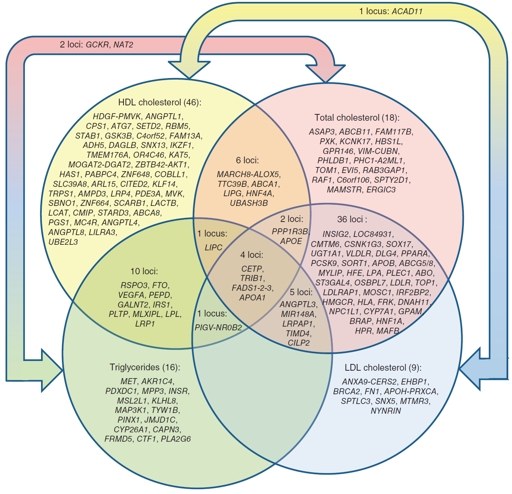
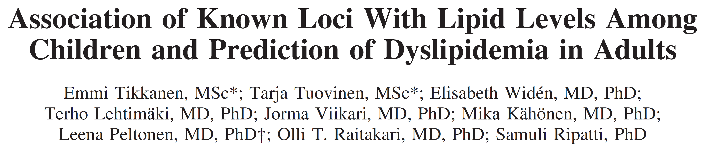

```{r global_options, include=F}
library(knitr)
# see http://kbroman.org/knitr_knutshell/pages/Rmarkdown.html
knitr::opts_chunk$set(out.width='700px', dpi=300,
                      echo=FALSE, warning=FALSE, message=FALSE, 
                      results='hide',
                      comment=NA
                      #fig.width=8, fig.height=8
                      #fig.path='Figs/',
                      )

library(Hmisc)
#library(tableone) 
library(data.table)
library(ztable)
options(ztable.type="html")
library(htmlTable)
library(readxl)
```

# Introduction

## Dyslipidemia in children

- Dyslipidemia is an important risk factor for chronic cardiometabolic diseases.

- Dsylipidemia represents any abnormal levels of lipid, lipoprotein, or apolipoprotein factors [@kwiterovich_clinical_2008], including:

      - total cholesterol (TC)
      - low density lipoprotein cholesterol (LDL-C)
      - triglycerides (TG)
      - high density lipoprotein choleseterol (HDL-C)

---

# Introduction

## Heritability of dyslipidemia

- Lipid traits are heritable (h$^2$ can exceed 0.50) [@goode_heritability_2007] and strongly associated with cardiovascular disease sustaining strong interest in genetic research.

- By 2013, researchers have identified more than 150 established loci influencing lipid levels in adults [@willer_discovery_2013].

---

# Introduction

## Lipid variants 

<center>

</center>


<div class="footer" style="font-size:50%">
Source: Willer, C. J., Schmidt, E. M., Sengupta, S., Peloso, G. M., Gustafsson, S., Kanoni, S., Abecasis, G. R. (2013). Discovery and refinement of loci associated with lipid levels. Nature Genetics, 45(11), 1274–1283. https://doi.org/10.1038/ng.2797
</div>

---

# Introduction

## Generalizability across ancestral groups

- Results found for adults have been found to generalize to children in a Finnish population [@tikkanen_association_2011; @buscot_combined_2016].


<center>

</center>

- Certain variants that associate with a trait such as dyslipdemia in one ancestral group may not associate in other groups [@carlson_generalization_2013].
    - Why? Differences across ancestral groups include:
        - Variant frequencies 
        - Linkage disequilibrium

- No research exists examining the association between genetic variants and dyslipidemia  in Hispanic/Latino (HL) children 

---

# Introduction

## Primary Aim

- Examine the association of known lipid variants with lipid traits identified in large study of adult participants from a Chilean infancy cohort of primarily European-descent. 
    - Compare results to those found in a Finnish population.

---

# Methods

## Association tests

- We assessed single variant associations using linear regression for high density lipoprotein cholesterol (HDL-C), low density lipoprotein cholesterol (LDL-C) and triglycerides (TG), assuming an additive genetic model, adjusted for sex and ancestry (via principal components).

  * Sample Model for HDL
    * $HDL_i = \beta_0 + SNP_i \beta_1 + sex_i \beta_2 + ANCESTRY_i \boldsymbol{\beta} + \epsilon_i$
    * $SNP_i$ represents one SNP with “genotypes were coded as 0, 1, or 2 when directly genotyped or as a predicted allele dosage (range, 0–2) when imputed.” [@tikkanen_association_2011]
    
* Only six variants from the Chilean sample met the *a priori* threshold of power > 0.8 to detect an association based on effect sizes from GWAS [@teslovich_biological_2010].

---

# Methods

## Polygenic risk scores

- Regress phenotypes onto weighted trait-specific polygenic risk scores (PRS).

  * Sample model for HDL
    * $HDL_i = \beta_0 + \beta_1 PRS1_i + \epsilon_i$
    * PRS for HDL-C
        - <font size="-0.5">(0.48 * rs4660293 + 0.49 * rs2814944 + 0.59 * rs4731702 + 0.41 * rs2923084 + 0.4 * rs7134375 + 0.44 * rs7134594 + 1.45 * rs1532085 + 3.39 * rs3764261 + 0.45 * rs2925979 + 0.42 * rs4148008 + 0.39 * rs4129767 + 0.64 * rs737337 + 1.88 * rs1800961 + 0.93 * rs6065906 + 0.47 * rs1689800 + 0.61 * rs4846914 + 0.68 * rs12328675 + 0.46 * rs2972146 + 0.49 * rs6450176 + 0.39 * rs605066 + 1.95 * rs1084651 + 1.21 * rs9987289 + 0.44 * rs2293889 + 0.65 * rs581080 + 0.94 * rs1883025 + 0.78 * rs3136441 + 0.86 * rs4759375 + 0.44 * rs4765127 + 0.61 * rs838880 + 0.39 * rs2652834 + 1.27 * rs16942887 + 0.48 * rs11869286 + 1.31 * rs7241918 + 0.42 * rs12967135 + 0.45 * rs7255436 + 0.83 * rs386000 + 0.46 * rs181362 + 0.84 * rs13107325) / 29.79</font>
        
  * All PRS are standardized in the regression models: regression coefficient for PRS indicates a one unit change in SD of PRS.

---

# Methods

## Proportion of variance explained by lipid-related SNPs

- Linear models containing all SNPs related to a specific phenotype, such as HDL-C, will be covariates. 
- The continuous lipid phenotype is the outcome. 
- Differences in R^2 will be calculated between models with and without the SNPs to estimate h$^2$.
      
    - Model for HDL: 
        - <font size="-0.5">$HDL_i$ = b0 + b1 * rs4660293 + b2 * rs2814944 + b3 * rs4731702 + b4 * rs2923084 + b5 * rs7134375 + b6 * rs7134594 + b7 * rs1532085 + b8 * rs3764261 + b9 * rs2925979 + b10 * rs4148008 + b11 * rs4129767 + b12 * rs737337 + b13 * rs1800961 + b14 * rs6065906 + b15 * rs1689800 + b16 * rs4846914 + b17 * rs12328675 + b18 * rs2972146 + b19 * rs6450176 + b20 * rs605066 + b21 * rs1084651 + b22 * rs9987289 + b23 * rs2293889 + b24 * rs581080 + b25 * rs1883025 + b26 * rs3136441 + b27 * rs4759375 + b28 * rs4765127 + b29 * rs838880 + b30 * rs2652834 + b31 * rs16942887 + b32 * rs11869286 + b33 * rs7241918 + b34 * rs12967135 + b35 * rs7255436 + b36 * rs386000 + b37 * rs181362 + b38 * rs13107325 + $\epsilon_i$</font>

---

# Results

## Descriptive statistics


<!-- Point to code to make all tables from summary statistics run on Kure -->
```{r echo=FALSE}
read_chunk("tables-slides.R")
```

<!-- Run code to make table from summary statistics run on Kure (see tables-slides.R)-->
```{r table1-1, results='hide'}
```

<center>
```{r table1-2, results='asis'}
```
</center>

- Note: All subsequent references to TG refer to log(TG).

<!-- ## Descriptive statistics (median [inter-quartile range]) -->

<!-- | Variable     | Female (n=263)       | Male (n=283)         | -->
<!-- |--------------|----------------------|----------------------| -->
<!-- | TG (mmol/l)  | 4.20 [3.24, 5.50]    | 3.99 [3.10, 5.62]    | -->
<!-- | LDL (mmol/l) | 5.26 [4.56, 6.11]    | 5.02 [4.27, 5.81]    | -->
<!-- | HDL (mmol/l) | 2.30 [1.96, 2.72]    | 2.05 [1.73, 2.39]    | -->
<!-- | TC (mmol/l)  | 8.55 [7.65, 9.44]    | 7.96 [7.24, 8.89]    | -->
<!-- | Age (years)  | 16.8 [16.6, 16.9]    | 16.76 [16.58, 16.90] | -->
<!-- | BMI (kg/m2)  | 23.25 [20.85, 26.17] | 22.31 [20.41, 25.53] | -->


<!--
<center>

</center>
-->

---

# Results

## Explained variance

<!-- prop variance explained by variants-->

<!-- Run code to make table from summary statistics run on Kure (see tables-slides.R)-->
```{r table2-1, results='hide'}
```

<center>
```{r table2-2, results='asis'}
```
</center>

<!-- |  Lipid trait | Females | Males | -->
<!-- |-------|---------|-------| -->
<!-- | HDL-C | 0.14    | 0.20  | -->
<!-- | LDL-C | 0.05    | 0.04  | -->
<!-- | TG    | 0.12    | 0.07  | -->

<br><br>

- The lipid loci explained the least amount of total variance for LDL (males=4% and females=5%) and the most amount of variance for HDL (males=20% and females=14%).

---

# Results

## Explained variance by gender and country

<!-- Run code to make table from summary statistics run on Kure (see tables-slides.R)-->
```{r fig2-1, results='hide'}
```

<center>
```{r fig2-2, fig.keep='last'}
```
</center>

---

# Results

## Candidate single variant tests of association

<!-- Run code to make table from summary statistics run on Kure (see tables-slides.R)-->
```{r assoc-1, results='hide'}
```

<center>
```{r assoc-2, results='asis'}
```
</center>


<!-- |Variant | Trait | Variant   | Locus          | Effect Size (SE) mmol/l | -->
<!-- |--------|-------|-----------|----------------|-------------------------| -->
<!-- |1       | HDL   | rs3764261 | CETP           | 0.158 (0.040)$^a$       | -->
<!-- |2       | HDL   | rs1532085 | LIPC           | 0.053 (0.038)           | -->
<!-- |3       | LDL   | rs6511720 | LDLR           | -0.013 (0.158)          | -->
<!-- |4       | TG    | rs1260326 | GCKR           | 0.360 (0.150)$^a$       | -->
<!-- |5       | TG    | rs964184  | APOA1–C3-A4-A5 | 0.326 (0.148)$^a$       | -->
<!-- |6       | TC    | rs6511720 | LDLR           | 0.125 (0.165)           | -->

<!-- $^a$ p-value < 0.05" -->


- For each significant variant, direction of effect matched the multiethnic adult GWAS from which SNPs were selected.

---

# Results

## Candidate single variant tests of association by variant and country

<!-- Run code to make table from summary statistics run on Kure (see tables-slides.R)-->
```{r fig-assoc-1, results='hide'}
```

<center>
```{r fig-assoc-2, fig.keep='last', echo=FALSE}
```
</center>

<div class="footer" style="font-size:50%">
Note: Adjusted for sex of child and first five principal components representing ancestry.
</div>


---

# Results: Weighted polygenic risk score (wPRS) regression coefficients

<!-- Run code to make table from summary statistics run on Kure (see tables-slides.R)-->
```{r table3-1, results='hide'}
```

<center>
```{r table3-2, results='asis'}
```
</center>

<!-- Association between the genetic risk score and serum lipid levels, coefficient$^a$ (se) -->
<!-- <center> -->
<!--  -->
<!-- </center> -->
<!-- $^a$ Effect sizes here are given for a one unit SD increase in the PRS. -->

- All estimates significant at $\alpha$ level of 0.05 with the exception of TG levels for males.

<!-- In comparing coefficients for the PRS between the Chilean and Finnish youth sample we found the association to be stronger in the Chilean sample in general.-->

# Results: Weighted polygenic risk score (wPRS) regression coefficients by country and gender

<!-- Run code to make table from summary statistics run on Kure (see tables-slides.R)-->
```{r fig3-1, results='hide'}
```

<center>
```{r fig3-2, echo=FALSE, fig.keep='last'}
```
</center>

<div class="footer" style="font-size:50%">
Notes: Coefficients represent change in outcome per 1 SD change in wGRS, adjusted for first five principal components representing ancestry but NOT BMI.
</div>

--- 

# Conclusion

## Evidence for associations

- There is evidence that lipid loci from a HL sample of adolescents contain similar associations as those from European children and adults.

- Despite the small sample size and possibility for bias with different ancestral groups we found meaningful and statistically significant associations relating lipid loci in a HL cohort of Chilean adolescents with those found in European ancestral groups.

- These associations emphasize the importance of adolescence as a time for disease prevention given studies demonstrating both the persistence of associations between PRS and lipids over the life course and the increasing role PRS plays in predicting disease.

---

# Extra slides, estimates from Tikkanen et al. [@tikkanen_association_2011]

## Descriptive statistics

<!-- Run code to make table from summary statistics run on Kure (see tables-slides.R)-->
```{r t-t1-1, results='hide'}
```

<center>
```{r t-t1-2, results='asis'}
```
</center>

# Extra slides, estimates from Tikkanen et al. [@tikkanen_association_2011]

## Proportion variance explained by lipid variants

<!-- Run code to make table from summary statistics run on Kure (see tables-slides.R)-->
```{r t-t2-1, results='hide'}
```

<center>
```{r t-t2-2, results='asis'}
```
</center>


# Extra slides, estimates from Tikkanen et al. [@tikkanen_association_2011]

## Single variant association tests

<!-- Run code to make table from summary statistics run on Kure (see tables-slides.R)-->
```{r t-t3-1, results='hide'}
```

<center>
```{r t-t3-2, results='asis'}
```
</center>


# Extra slides, estimates from Tikkanen et al. [@tikkanen_association_2011]

## Polygenic risk score

<!-- Run code to make table from summary statistics run on Kure (see tables-slides.R)-->
```{r t-t4-1, results='hide'}
```

<center>
```{r t-t4-2, results='asis'}
```
</center>

---

# Extra slides: effect sizes used in PRS from Teslovich et al. 2010 [@teslovich_biological_2010].

```{r, echo=FALSE, results='markup'}
snp.dat = read.csv('teslovich-snps.csv')
#head(snp.dat)
colnames(snp.dat) = c("Locus", "Chr", "Lead SNP", "Lead trait", "Other traits", "Alleles/MAF", "Effect size")
kable(snp.dat)
```

<!-- Copied C:\Users\vonholle\Documents\dissertation\unc-dissertation-markdown\includes\table-data\teslovich-snps.csv and pasted into http://www.tablesgenerator.com/markdown_tables to get the following markdown table.

| Locus     | Chr | Lead SNP   | Lead trait | Other traits | Alleles/MAF | Effect size |
|-----------|-----|------------|------------|--------------|-------------|-------------|
| LDLRAP1   | 1   | rs12027135 | TC         | LDL          | T/A/0.45    | -1.22       |
| PABPC4    | 1   | rs4660293  | HDL        |              | A/G/0.23    | -0.48       |
| PCSK9     | 1   | rs2479409  | LDL        | TC           | A/G/0.30    | 2.01        |
| ANGPTL3   | 1   | rs2131925  | TG         | TC, LDL      | T/G/0.32    | -4.94       |
| EVI5      | 1   | rs7515577  | TC         |              | A/C/0.21    | -1.18       |
| SORT1     | 1   | rs629301   | LDL        | TC           | T/G/0.22    | -5.65       |
| ZNF648    | 1   | rs1689800  | HDL        |              | A/G/0.35    | -0.47       |
| MOSC1     | 1   | rs2642442  | TC         | LDL          | T/C/0.32    | -1.39       |
| GALNT2    | 1   | rs4846914  | HDL        | TG           | A/G/0.40    | -0.61       |
| IRF2BP2   | 1   | rs514230   | TC         | LDL          | T/A/0.48    | -1.36       |
| APOB      | 2   | rs1367117  | LDL        | TC           | G/A/0.30    | 4.05        |
|           |     | rs1042034  | TG         | HDL          | T/C/0.22    | -5.99       |
| GCKR      | 2   | rs1260326  | TG         | TC           | C/T/0.41    | 8.76        |
| ABCG5/8   | 2   | rs4299376  | LDL        | TC           | T/G/0.30    | 2.75        |
| RAB3GAP1  | 2   | rs7570971  | TC         |              | C/A/0.34    | 1.25        |
| COBLL1    | 2   | rs10195252 | TG         |              | T/C/0.40    | -2.01       |
|           |     | rs12328675 | HDL        |              | T/C/0.13    | 0.68        |
| IRS1      | 2   | rs2972146  | HDL        | TG           | T/G/0.37    | 0.46        |
| RAF1      | 3   | rs2290159  | TC         |              | G/C/0.22    | -1.42       |
| MSL2L1    | 3   | rs645040   | TG         |              | T/G/0.22    | -2.22       |
| KLHL8     | 4   | rs442177   | TG         |              | T/G/0.41    | -2.25       |
| SLC39A8   | 4   | rs13107325 | HDL        |              | C/T/0.07    | -0.84       |
| ARL15     | 5   | rs6450176  | HDL        |              | G/A/0.26    | -0.49       |
| MAP3K1    | 5   | rs9686661  | TG         |              | C/T/0.20    | 2.57        |
| HMGCR     | 5   | rs12916    | TC         | LDL          | T/C/0.39    | 2.84        |
| TIMD4     | 5   | rs6882076  | TC         | LDL, TG      | C/T/0.35    | -1.98       |
| MYLIP     | 6   | rs3757354  | LDL        | TC           | C/T/0.22    | -1.43       |
| HFE       | 6   | rs1800562  | LDL        | TC           | G/A/0.06    | -2.22       |
| HLA       | 6   | rs3177928  | TC         | LDL          | G/A/0.16    | 2.31        |
|           |     | rs2247056  | TG         |              | C/T/0.25    | -2.99       |
| C6orf106  | 6   | rs2814944  | HDL        |              | G/A/0.16    | -0.49       |
|           |     | rs2814982  | TC         |              | C/T/0.11    | -1.86       |
| FRK       | 6   | rs9488822  | TC         | LDL          | A/T/0.35    | -1.18       |
| CITED2    | 6   | rs605066   | HDL        |              | T/C/0.42    | -0.39       |
| LPA       | 6   | rs1564348  | LDL        | TC           | T/C/0.17    | -0.56       |
|           |     | rs1084651  | HDL        |              | G/A/0.16    | 1.95        |
| DNAH11    | 7   | rs12670798 | TC         | LDL          | T/C/0.23    | 1.43        |
| NPC1L1    | 7   | rs2072183  | TC         | LDL          | G/C/0.25    | 2.01        |
| TYW1B     | 7   | rs13238203 | TG         |              | C/T/0.04    | -7.91       |
| MLXIPL    | 7   | rs17145738 | TG         | HDL          | C/T/0.12    | -9.32       |
| KLF14     | 7   | rs4731702  | HDL        |              | C/T/0.48    | 0.59        |
| PPP1R3B   | 8   | rs9987289  | HDL        | TC, LDL      | G/A/0.09    | -1.21       |
| PINX1     | 8   | rs11776767 | TG         |              | G/C/0.37    | 2.01        |
| NAT2      | 8   | rs1495741  | TG         | TC           | A/G/0.22    | 2.85        |
| LPL       | 8   | rs12678919 | TG         | HDL          | A/G/0.12    | -13.64      |
| CYP7A1    | 8   | rs2081687  | TC         | LDL          | C/T/0.35    | 1.23        |
| TRPS1     | 8   | rs2293889  | HDL        |              | G/T/0.41    | -0.44       |
|           |     | rs2737229  | TC         |              | A/C/0.30    | -1.11       |
| TRIB1     | 8   | rs2954029  | TG         | TC, LDL, HDL | A/T/0.47    | -5.64       |
| PLEC1     | 8   | rs11136341 | LDL        | TC           | A/G/0.40    | 11.4        |
| TTC39B    | 9   | rs581080   | HDL        | TC           | C/G/0.18    | -0.65       |
| ABCA1     | 9   | rs1883025  | HDL        | TC           | C/T/0.25    | -0.94       |
| ABO       | 9   | rs9411489  | LDL        | TC           | C/T/0.20    | 2.24        |
| JMJD1C    | 10  | rs10761731 | TG         |              | A/T/0.43    | -2.38       |
| CYP26A1   | 10  | rs2068888  | TG         |              | G/A/0.46    | -2.28       |
| GPAM      | 10  | rs2255141  | TC         | LDL          | G/A/0.30    | 1.14        |
| AMPD3     | 11  | rs2923084  | HDL        |              | A/G/0.17    | -0.41       |
| SPTY2D1   | 11  | rs10128711 | TC         |              | C/T/0.28    | -1.04       |
| LRP4      | 11  | rs3136441  | HDL        |              | T/C/0.15    | 0.78        |
| FADS1-2-3 | 11  | rs174546   | TG         | HDL, TC, LDL | C/T/0.34    | 3.82        |
| APOA1     | 11  | rs964184   | TG         | TC, HDL, LDL | C/G/0.13    | 16.95       |
| UBASH3B   | 11  | rs7941030  | TC         | HDL          | T/C/0.38    | 0.97        |
| ST3GAL4   | 11  | rs11220462 | LDL        | TC           | G/A/0.14    | 1.95        |
| PDE3A     | 12  | rs7134375  | HDL        |              | C/A/0.42    | 10.4        |
| LRP1      | 12  | rs11613352 | TG         | HDL          | C/T/0.23    | 22.7        |
| MVK       | 12  | rs7134594  | HDL        |              | T/C/0.47    | -0.44       |
| BRAP      | 12  | rs11065987 | TC         | LDL          | A/G/0.42    | -0.96       |
| HNF1A     | 12  | rs1169288  | TC         | LDL          | A/C/0.33    | 1.42        |
| SBNO1     | 12  | rs4759375  | HDL        |              | C/T/0.06    | 0.86        |
| ZNF664    | 12  | rs4765127  | HDL        | TG           | G/T/0.34    | 0.44        |
| SCARB1    | 12  | rs838880   | HDL        |              | T/C/0.31    | 0.61        |
| NYNRIN    | 14  | rs8017377  | LDL        |              | G/A/0.47    | 1.14        |
| CAPN3     | 15  | rs2412710  | TG         |              | G/A/0.02    | 7           |
| FRMD5     | 15  | rs2929282  | TG         |              | A/T/0.05    | 5.13        |
| LIPC      | 15  | rs1532085  | HDL        | TC, TG       | G/A/0.39    | 1.45        |
| LACTB     | 15  | rs2652834  | HDL        |              | G/A/0.20    | -0.39       |
| CTF1      | 16  | rs11649653 | TG         |              | C/G/0.40    | -2.13       |
| CETP      | 16  | rs3764261  | HDL        | TC, LDL, TG  | C/A/0.32    | 3.39        |
| LCAT      | 16  | rs16942887 | HDL        |              | G/A/0.12    | 1.27        |
| HPR       | 16  | rs2000999  | TC         | LDL          | G/A/0.20    | 2.34        |
| CMIP      | 16  | rs2925979  | HDL        |              | C/T/0.30    | -0.45       |
| STARD3    | 17  | rs11869286 | HDL        |              | C/G/0.34    | -0.48       |
| OSBPL7    | 17  | rs7206971  | LDL        | TC           | G/A/0.49    | 0.78        |
| ABCA8     | 17  | rs4148008  | HDL        |              | C/G/0.32    | -0.42       |
| PGS1      | 17  | rs4129767  | HDL        |              | A/G/0.49    | -0.39       |
| LIPG      | 18  | rs7241918  | HDL        | TC           | T/G/0.17    | -1.31       |
| MC4R      | 18  | rs12967135 | HDL        |              | G/A/0.23    | -0.42       |
| ANGPTL4   | 19  | rs7255436  | HDL        |              | A/C/0.47    | -0.45       |
| LDLR      | 19  | rs6511720  | LDL        | TC           | G/T/0.11    | -6.99       |
| LOC55908  | 19  | rs737337   | HDL        |              | T/C/0.08    | -0.64       |
| CILP2     | 19  | rs10401969 | TC         | TG, LDL      | T/C/0.07    | -4.74       |
| APOE      | 19  | rs4420638  | LDL        | TC, HDL      | A/G/0.17    | 7.14        |
|           |     | rs439401   | TG         |              | C/T/0.36    | 25.5        |
| FLJ36070  | 19  | rs492602   | TC         |              | A/G/0.49    | 1.27        |
| LILRA3    | 19  | rs386000   | HDL        |              | G/C/0.20    | 0.83        |
| ERGIC3    | 20  | rs2277862  | TC         |              | C/T/0.15    | -1.19       |
| MAFB      | 20  | rs2902940  | TC         | LDL          | A/G/0.29    | -1.38       |
| TOP1      | 20  | rs6029526  | LDL        | TC           | T/A/0.47    | 1.39        |
| HNF4A     | 20  | rs1800961  | HDL        | TC           | C/T/0.03    | -1.88       |
| PLTP      | 20  | rs6065906  | HDL        | TG           | T/C/0.18    | -0.93       |
| UBE2L3    | 22  | rs181362   | HDL        |              | C/T/0.20    | -0.46       |
| PLA2G6    | 22  | rs5756931  | TG         |              | T/C/0.40    | -1.54       |
-->


# Extra slides: Other work

1. [AHA EPI/Lifestyle 2015 Poster: Childhood body mass index (BMI) z-scores associated with low HDL-C levels in adolescence in a Chilean cohort](http://vonholle.web.unc.edu/files/2015/02/slides.20150226.pdf)

2. [UNC EPID 726 class presentation in advance of AHA predoctoral (successful) grant application (2016-2018)](http://vonholle.web.unc.edu/files/2015/02/slides-epid726-avh-20150409.pdf)

3. [Questions about analyses? Please visit the github web page!](https://github.com/avonholle/ms-201608-1)

4. [Assistance with slides by Ann Von Holle, doctoral student](https://vonholle.web.unc.edu/)

# References

<font size="-1">


